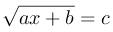

# D. Уравнение с корнем

Решите в целых числах уравнение:

a, b, c – данные целые числа: найдите все решения или сообщите, что решений в целых числах нет.

## Формат ввода
Вводятся три числа a, b и c по одному в строке.

## Формат вывода
Программа должна вывести все решения уравнения в порядке возрастания, либо NO SOLUTION (заглавными буквами), если решений нет. Если решений бесконечно много, вывести MANY SOLUTIONS.

### Пример 1
Ввод | Вывод
---| ---
1   0   0 | 0    

### Пример 2
Ввод | Вывод
---| ---
1   2   3 | 7    

### Пример 3
Ввод | Вывод
---| ---
1   2   -3 | NO SOLUTION    
