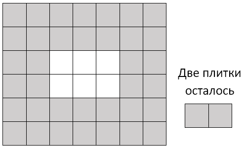

# G. Площадь

Городская площадь имеет размер *n × m* и покрыта квадратной плиткой размером 1 × 1. При плановой замене плитки выяснилось, что новой плитки недостаточно для покрытия всей площади, поэтому было решено покрыть плиткой только дорожку по краю площади, а в центре площади разбить прямоугольную клумбу (см. рисунок к примеру). При этом дорожка должна иметь одинаковую ширину по всем сторонам площади. Определите максимальную ширину дорожки, которую можно выложить из имеющихся плиток.

## Формат ввода
Первая и вторая строки входных данных содержат по одному числу *n* и *m (3 ≤ n ≤ 2 × 109, 3 ≤ m ≤ 2 × 10 9)* — размеры площади.

Третья строка содержит количество имеющихся плиток *t, 1 ≤ t < n × m*.

**Обратите внимание, что значение *t* может быть больше, чем возможное значение 32-битной целочисленной переменной, поэтому необходимо использовать 64-битные числа (тип int64 в языке Pascal, тип long long в C и C++, тип long в Java и C#).**

## Формат вывода
Программа должна вывести единственное число — максимальную ширину дорожки, которую можно выложить из имеющихся плиток.

### Пример 1
Ввод | Вывод
---| ---
6   7   38 | 2    

## Примечание
Пояснение к примеру. Площадь имеет размеры 6 × 7, из 38 плиток можно выложить дорожку шириной в 2 плитки.

